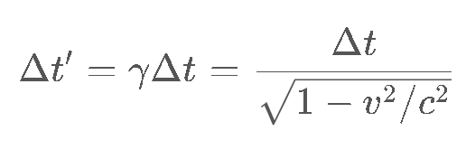

# The New Theory of Everything

– Indivison Theory

Author: Xin Feng

# Abstract

This theory proposes a unified framework that seeks to reconcile the principles of the Theory of Relativity and Quantum Mechanics by offering a novel perspective on the cosmos's fundamental nature. 

This theory can explain:

-   Dark Matter
-   Dark Energy
-   Light wave-particle duality
-   Superposition and Collapse after measurement
-   Faster than light particles
-   Origin of mass
-   Why mass slow down time(change)
-   Why speed slow down time
-   Gravity
-   Redshift of Light: Doppler Redshift and Wear-and-tear Redshift
-   Big Bang
-   Black hole
-   Vacuum Energy
-   Quantum Foam

**Basic rule of Indivison Theory:**

**Everything in the universe (including photon, all known particles in Standard Model, electric field, magnetic field, gravity) is made of tiny dots called “Indivison”. All indivisons move through space at a constant speed faster than light and the speed never changes. 2 Indivisons can get "entangled" accross unlimited distances. When changes happen, 2 entangled indivisons will swap location(or swap direction, witch has similar effect as swap location).**

There can be many potential rules about how “changes” happen, one of the simplest rules is:

Rule 1

-   **Indivisons move at a speed faster than light, they never change directions. When 2 indivisons A and B meets, A and B become “entangled”, when later indivison B meets indivison C, then B and C become entangled and A and B swap locations while keeping their original speed and direction.**

The reason indivison gets its name is that I believe they are not divisible. An indivison has only very simple behaviour:

-   Moving on a straight line.
-   Getting entangled with another indivison if it is not entangled already.
-   Swapping location with entangled indivison.

I don’t think the behavior of an indivison can be simpler. If a thing’s behavior is the simplest, then the thing is the simplest, not divisible anymore.

# Computer Simulation

Just by using the simple rule 1, computer simulation can create complex indivison particles with wave-particle duality.

In this paper, a “particle” is defined as “a group of indivisons that is stable, with repeated movement patterns and can stay same patterns for long period.”

Using the simple rule of indivison, computer simulations show that bigger stable particles can exist, they all show wave-particle duality.

I have created simulation of 1D particles, 2D particles, 3D particles. Source code is attached with this paper.

### 1D Simulation

In 1 Dimensional Simulation, all indivisons are moving on single straight line. Some moving left, some moving right. In the following screenshot, horizontal axis is the space, vertical axis is time (top is current, bottom is past).

In 1D simulation, indivisons are initially created at random locations and random directions. When first started, the indivisons were in chaos, after a little while, they started to form mini-particles, then mini-particles collide and form bigger particles.

I call these particles with a few or dozens of indivisons: mini-particles, this is to distinguish with known particles such as photons or electrons, and they are much smaller than known particles.

Random seed 3:

Random seed 2:

1D Simulation Video:

<https://drive.google.com/file/d/1-ObBcOE18TUuP8cxEZ34In5s8FaKw2nx/view?usp=sharing>

### 2D Simulation

IN 2D Simulation, all indivisons move on same plane.

As shown in following picture, random indivisons on a 2D plane easily form particles of large groups, with particles showing “wave” features.

The following picture is created when random indivisons with random directions are create at a small area. Particles are easily formed in almost every simulation.

2D Simulation Video:

<https://drive.google.com/file/d/1-ME2LYs_DuFv2CAJ6w1YOUBh0Yc_-5YZ/view?usp=sharing>

### 3D Simulation

In the attached source code, the code initially randomly creates indivisons and indivisons easily form particles that form particles with repeated patterns. The following screenshot shows particles (with trails). When we look at the trails of the particles, we can see all particles have repeated “wave-like” patterns.

In this code, each time the simulator found a particle that contains more than 5 indivisons (too many smaller particles and no need to record them all), the simulator will save the particle to file system. When the simulator is in the “colliding” mode, it will load the particles from the previously saved particles and generate many copies and let them run towards a center location and collide with each other to create new particles. Most of the times, particles collide and become smaller particles. Once a while, it will create bigger particles. Currently we have particles as big as 13 indivisons.

With enough computing resource, hopefully we can create bigger particles like photons, electrons, and protons.

3D Simulation Video:

<https://drive.google.com/file/d/1-PPGXVBGOBfhkAWeP3J2teoqUoxEQqs7/view?usp=sharing>

As we can see, randomly formed particles have different patterns and shapes. I think it’s like rocks in space, when they are small (a few centimeters to a few kilometers, they all have different shapes. When space objects are big (moons, planets, and stars), they all look like a sphere. I think particles are similar, when a particle contains a few or a few dozens of indivisons, they all have different patterns and shapes; when a particle contains millions, billions, or trillions of indivisons, they will all look similar (electrons, protos etc).

One of the key differences between Indivison Theory and the Theory of Relativity is the concept of space-time. In the Theory of Relativity, space and time are seen as two aspects of a single entity called space-time. However, in Indivison Theory, space and time are treated as separate entities, time will not change by speed or mass. There is absolute space, absolute reference frame and absolute time.

## What more need to be done with simulators

-   More computing recourse is needed to simulate millions, billions, even trillions of indivisons
-   Try different rules to see which rule create particles most close to real world. Things need to be decided: when multiple indivisons collide at the same location, what will happen? Which indivisons becomes entangled after the collision?
-   More efficient algorithm needed. When indivison density is low, move all indivisons once per on time frame might not be efficient, using the projected path to calculate collision might be more efficient.
-   How does entanglement work:

#### is it one-way or 2-way?

#### One-way entanglement:

Indivison A entangled with B, B entangled with C, C can entangle with A. A circle of entanglement is possible. Each entanglement is “an arrow”.

#### Two-way entanglement:

An entangled with B, B must entangle with A. Each entanglement is a line connecting 2 indivisons.

#### A. Multiple entanglement or single entanglement?

#### Multiple entanglement:

A, B and C are entangled at same time, more than 2 indivisons can be entangled.

#### Single entanglement

A and B are entangled, only 2 indivisons can be involved in direct entanglement.

# Introduction

## Background and Motivation

Indivison Theory proposes that the universe is composed only one thing: indivison. There is only one force in the universe: swap locations of indivisons.

# Hypothesis

This is how indivisons work.

Let’s assume two unentangled indivisons A and B running in straight line. A and B collide in space. When they collide, A and B do not change speed or direction, they keep moving in straight line. After A and B collide, A and B become “entangled”. When later dot B collides with dot C, A and B swap locations, while keeping their speed and direction unchanged.

## Simplicity, Elegance, and Beauty

This theory is so simple, so elegant, and so beautiful, it almost feels criminal if this theory is not true. Simplicity, elegance, and beauty do not guarantee it’s true, but they do increase the likelihood that it is true.

### Simplicity

A simple rule of just one sentence, it describes how the whole universe works. As in Occam's Razor principle, where the simplest explanation is often preferred. The universe in Indivison Theory is much simpler than Theory of Relativity and Quantum Theory, and simpler than other potential Theory of Everything candidates such as String Theory and Loop Quantum Gravity. The whole universe can be described in one sentence in Indivison Theory.

### Elegance

Indivison Theory has One equation:

E = M = I

Energy = Mass = Indivison

There is no “unit” for this equation. It is just “count”.

### Symmetry

Entangled indivisons swap locations. It has symmetry for momentum, mass center, location, speed, direction and even time.

### Unification

Indivison Theory unifies Theory of Relativity and Quantum Theory. It unifies all forces into a single force: indivisons swapping locations.

### Universality

Indivison Theory applies universally, across a wide range of scales and conditions, from the smallest thing in universe to gravity of largest galaxies.

### Consistency

Indivison Theory has internal consistency (lack of contradictions within the theory) and external consistency (agreement with existing well-established phenomenon).

## Indivisons: wave-particle duality

Computer simulation shows that one incredibly simple rule can create “particles” which have wave-particle duality.

Unlike in the Theory of Relativity, time in Indivison Theory does not change with speed or gravity. Instead, there is an absolute time that is independent of the motion of the indivisons. Time has smallest chunks which is much smaller than Planck time. Indivisons all move at same speed which is faster than light.

## One-dimensional Particle: Quaton

There is a small 4-indivison stable structure: quaton. This structure show wave-particle duality.

This is a concrete example that the Indivison Theory can create stable particle structure.

The following chart shows how 4 indivisons moving on one straight line can create a stable structure (particle) with the simple and the only rule in the universe.

On the following chart, the vertical axis is the space, the numbers on the left are the coordinate in space. The horizontal axis is the time. If 2 or more letters are in the same cell, that means those indivisons are at the same location at the same time.

The black color of letters (a, b, C and D) means the dot is not “entangled”.

When 2 different letters have same color other than black, that means these 2 letters are “entangled”.

Let’s assume indivisons a, b, C, and D are not entangled with any other indivisons.

Two indivisons “a” and “b” traveling downward (lower case letters traveling down), 2 dots C and D traveling upwards (upper case letters traveling up). At time 0, we start the recording.

At time 3, a and C meet, a and C become “entangled”. At time 5 (column H), D and a meet, because C and a are entangled, at time 5 (column I), C and a swap location. Column H, I and J are same time on time axis, in this chart it is separated into 3 columns because 3 things happened:

-   D and a meet
-   C and a swap location
-   C and a get entangled

At time 8 (column M), dots D, C, and a meet, at time 8(column N), C and a become entangled.

At time 15 (column U), dots b, C and D meet.

At time 15 (column V), dot a and C swap locations.

At time 15 (column W), b and D become entangled.

At time 22 (column AD), a, b and C meet

At time 22 (column AE), b and D swap locations

At time 22 (column AF), C and a become entangled

…

Starting from time 15 (Column U), a, b, C and D started a stable structure that repeats infinitely, Time 15 to Time 29 is a circle of the repeat. As we can see, it is a particle, and also a wave.

Red line is the position of mass center of the 4 dots.

### Two-dimensional Quaton

The previous is the one-dimensional version.

This is the two-dimensional version.

All 4 indivisons are on same plane, also on same straight line, shrink all distance between the indivisons by multiplying  . In following diagram, both vertical and horizontal axis are space. Horizontal direction is the direction of movement of mass center (a, b, C, and D). All 4 indivisons starts at column B. Indivison a and b travel 45 degrees south-east, indivison C and D travel 45 degrees north-east. Each of the indivison travel at speed 1, the mass center of the particle quaton travels at speed.

 .

If we split each column of collision into 2 or 3 columns reflecting events happened, we get this: 

In Indivison Theory, these indivisons are mass, and energy. Indivisons are mass because they compose everything in the universe. Indivisons are energy because dots cause all the changes in the universe. This means that all physical phenomena in the universe can be explained in terms of the movement and interactions of these indivisons.

As we can see, a group of indivisons naturally form “waves” with repeated patterns.

In this simulation, when 2 indivisons are at the same location and moving towards same direction, they are not considered to be “colliding”. If we change the rule in this simulation to “2 indivisons are considered colliding regardless direction when they are occupying same location”, the computer simulation will get different results in high indivison density situations, but in low indivison density situation, this change will not matter much because 2 indivisons at same location and travelling same direction will be extremely rare except in high indivison density situations such as inside a black hole.

Rule 2

There is a second possible rule. This rule is similar to previous rule.

-   **Indivisons move at a speed slightly faster than light speed, they never change directions. When 2 indivisons A and B meets, A and B become “entangled”, when later indivison B meets indivison C, then A and B swap locations while keeping their original speed and direction. Only indivisons which are not entangled with any indivisons can become entangled.**

This rule means once 2 indivisons are entangled, they will never get disentangled. This rule will make the long-term entanglement between 2 faraway particles much easier.

This a diagram of 1D simulation. Horizon numbers are time. Vertical numbers are locations.

There can be more possible rules matching the Basic Rule of Indivison Theory, but the more complex the rule is, the less likely it will be true. I think rule 2 is more likely to be true because it is simple, and it makes make the long-term entanglement between 2 faraway particles much easier.

# Predictions of Indivison Theory

## Size of Indivisons

In Indivison Theory, an indivison could have size, the size is the collision distance, and the size is much smaller than Planck Length.

## Shape of indivisons

Most likely shapes are sphere or cube. This is because indivison theory is supposed to be simple, and these 2 shapes are the least computation intensive shapes when using computer to simulate collision.

## Explaining time dilation using Indivison Theory

In Theory of Relativity, when objects move faster, their time slows down. In Indivison Theory, time does not slow down, “electromagnetic related changes” slow down. The difference between “time” and “change”? It is like putting a banana in fridge, the clock inside the fridge and clock outside the fridge runs at same speed, but the change(rotting) of banana inside fridge slows down.

Let’s visually explain how “change” slows down in Indivison Theory without “time” slowing down.

Assuming “c” is speed of light. Green dot is the mass center of the 2 dots (photons or other light-speed particles). Blue arrows are the moving direction vector of the dots (orange color).

#### Scenario 1

Let’s assume there is an object, composed of only 2 dots. This object’s “mass” center is stationary (speed is zero). Because all the dots are moving at speed of light, that means the only way the object of 2 dots have mass center to have speed of zero is like this:

The 2 orange dots are 2 dots traveling the opposite direction, the green dot is the “mass center” having the speed of zero.

The speed of the “size change” of the “two-dot object” is growing at a speed of 2c per second.

#### Scenario 2

The “two-dot object” is moving at of speed of 0.5c to the right. That means the mass center (green dot) is moving at 0.5c to the right (red arrow).

Because the dots still must move at speed c, that means the size change speed of the “two-dot object” is:

Now let’s compare the “Time dilation equation” of Theory of Relativity:

where:

-   ′Δ*t*′ – Time that has passed as measured by a stationary observer (relative time);
-   *γ* – Lorentz factor;
-   Δ*t* – Time that has passed as measured by the traveling observer;
-   *v* – Speed of the traveling observer;
-   *c* – Speed of light

Using this equation, when the object is moving at 0.5c, the time will slow down to:

Then we can get:

That means our Indivison Theory matches Theory of Relativity perfectly in the micro-level.

#### Scenario 3

When it’s an extreme, when an object is at the speed of light, there can be no internal relative change because all the dots are moving in parallel, internal change totally freeze, change stops. The dots moving in parallel at speed of light has no relative position change withing the group. From “Indivison Theory” perspective, “change stops”. From Theory of Relativity perspective, “Time stops”.

The red arrow the direction of mass center of the two-dot object, the blue arrows are the directions of the two dots.

The two-dot object is moving to the right at the speed of light, the relative location of the 2 dots never changes, the object’s size never changes. The change of the two-dot object slows down to zero.

In Theory of Relativity, when objects move fast, “time” slows down, as a result, change slows down.

In Indivison Theory, when objects move fast, “internal eletromagnetic changes” slows down, time does not slow down.

In Indivison Theory, the “dots” previous mentioned are Photons, and other particles travelling similar speed as photons. The dots can also be a group of indivisons (particles made of indivisons).

## What is photon?

Photon is made up of indivisons. A photon is made of huge group of indivisons, maybe thousands, millions, billions, or trillions of indivisons.

Photon is complex group of indivison traveling together. The photon shrinks and expands while travelling in space.

Because photon is a group of indivisons, it is a “particle”. Because the group of indivisons shrink and expand in size when it moves through space, it also shows “wave” properties. When photon shrink, the density of indivisons is high, this is where we have high possibility to detect photon because high density of indivisons can react with other particles easily.

The more the indivisons in a photon, the more chances indivisons collide with each other in photon, the changes happen more quickly, and frequency of photo is higher, and the energy of a photo is higher.

### Double slit experiment

Double slit experiment shows that photon is not detected in certain areas, this is because in those “dark” areas, a photon expanding so the density of the photon is low so single atom or molecule cannot interact with such low density of indivisons to produce any detectable phenomenon by current technology involving photon. But I think we still might detect indivisons.

Why double slit experiment shows as wave interference? Photon is a group of indivisons travelling together, this group expand and shrink in size. When the group expands, the density of the indivisons of a photon is low, so it is not easy to be detected by atoms or other ways. When the group of indivisons shrink in size, the indivisons density is higher and it is easy to cause visible interaction with atoms.

A photon is likely composed of billions or trillions of indivisons, those indivisons could go through both slit at the same time or pass through wall with slits.

One possibility that even single photon passing through slits and hitting on sensor screen when a photon is at “expansion” state and not causing visible change, it could still change the atom states in a subtle and undetectable way, similar to wind blow sand on ground and move the sand a little. In desert full of sand, a single breeze of wind will move the sand a little bit and barely noticeable; next breeze of wind move sand to opposite direction, after many breezes, the sands form some sort of waves pattern that is very clear. Similarly, the photon in “low indivison density mode” might not change a single atom in an obvious way but may photons in “low indivison density mode” could add up to an atom and cause thermal reaction and “dark count” or other visible results.

## Superposition and Collapse after measurement

In Indivison Theory, when 2 particles are entangled, this means some indivisons in particle A is entangled with some indivisons in particle B. After measurement causing collapse, indivisons inside particle A are only entangled with indivisons inside particle A, indivisons inside particle B are only entangled with indivisons inside particle B.

## Experiment to detect indivisons.

Currently we don’t have the technology to detect individual indivisons because indivisons are too small, but we can try to detect indivisons in large groups.

### Experiment 1: Modified Double Slit Experiment

This is a modified version of double slit experiment.

2 slits in front of a photon sensitive screen. The screen shows some area detect higher number of photons; some areas detect less photons. Now vertically cut the screen in to sections according to the density of detected photons: From left to right of the original screen, now the screen is cut into many vertical long columns. Let’s assume we cut into 7 columns: Low photon area 1, High photon area 2, Low photon area 3, High photon area 4, Low photon area 5, High photon area 6, Low photon area 7.

Record how many photons are detected by each column of fields in one hour. Let’s assume the photons detected by each column is: 1 million, 2 billion, 1 million, 2 billion, 1 million, 2 billion, 1 million.

Now replace the 7 column of photon sensor with 7 columns of heat sensor of the same size. Put thin mirrors between heat sensors to make sure heat from one sensor wont leak to nearby sensors. If traditional quantum theory is correct, photons only “exist” at the location of wave function predicts, then after one hour, the heat detected should be in the proportion of 1J, 2000J, 1J, 2000J, 1J, 2000J, 1J. If Indivison Theory is correct, then after one hour, the heat detected could be in the proportion of 10J, 2005J, 10J, 2005J, 10J, 2005J, 10J. The areas detecting less photons are getting more proportion of heat than the number of photons predict. This is because although the low photon area detects less photons, they also absorb the indivisons when a photon expands to low indivision density, so they absorb more heat than the proportion of photon detected. Some of the heat cannot be explained by photon alone, but they can be explained by low density of indivisons.

Now replace the 7 column of heat sensor with 7 columns of momentum sensor of the same size. Same as the heat sensor, if energy detected by momentum detector on low photon momentum sensor has higher proportion than photon detected, then Indivison Theory is correct rather than the quantum theory wave function. Momentum sensor can be a thin film hanging with very long thin threads in vacuum of black internal surface box.

This experiment can happen inside vacuum box with pure black inside face to reduce reflection of photons.

### Use gravity wave detectors.

#### Method 1: Solar flares

Because gravity is caused by small indivison groups, gravity wave is actually waves of indivisons (isolated or particles of small indivisons), we can use gravity wave to detect indivisons. Solar flares have the potential to emit particles of small indivisons. If gravity wave detectors detect gravity wave minutes or seconds earlier before photons of solar flare reach earth, then it means something faster than light is detected.

#### Method 2: Nuclear explosion

The gravity change of solar flare might be overwhelmed by other parts of sun and not easy to be detected, then another possibility is sending a nuclear bomb to outer space that is very far from earth (for example, light traveling one minute). When the nuclear bomb explodes, the gravity wave detectors detect changes seconds before the light telescopes. This proves that indivisons travel faster than light. The time that we detect gravitational wave might not be the fastest speed that indivison can travel.

Nuclear explosion might be too weak to produce detectable gravity wave.

#### Method 3: Match gravity wave with history events

Depending on the sensitivity of gravitational wave detector, the fastest smaller indivison particles from stars might already arrived at earth but we are not able to detect them.

The gravitational wave strength we detect might be a bell shape:

The middle vertical line is the light speed indivison particles including photons, the right side of the chart shows the indivison amount we detect that travels faster than light, the left side shows the amount of indivisons we detect that travels slower than light speed. The reason we detect indivisons at different speed is because indivisons form small groups and the mass center of the groups travels at different speed.

If an astronomical event 1 light year away was detected by telescope and gravity wave detector, we can check whether in the past year, gravitational wave detector detected some events that could be caused by this event, if so, it might mean some indivisons traveling faster than light and arrived at Earth earlier than light.

## What are known particles?

Proton, electron, neutron, neutrino, quark, electric field, magnetic field, gravity field, everything is made of indivisons. They are just different number of indivisons grouped in different 3D patterns.

## The fastest speed in the universe

In Indivison Theory, the fastest is not photon/light, it is Indivison. In Theory of Relativity, when things approach speed of light, the time slows down to zero, and light experiences no time at all. But we all know a photon changes thousands, millions, or trillions of times per second, no matter what reference frame we use. How can we say photon experience no change and no time?

All the experiments human for time dilation can only prove electro-magnetic related activity slows down, but they cannot prove “things inside photon” also slow down changes.

I think “photon experience frequency and electric and magnetic field strength change in all reference frame” proves “photon undergo changes” and “**time does not stop inside photon**”. “**Time does not stop inside photon**” proves “**something faster than light exists**”.

## The nature of speed change

In Indivison Theory, the speed of an indivison never changes, the direction of an indivison never changes. Then why in macro world a rocket can go faster and faster, a car can speed up and slow down?

In Indivison Theory, the only way to change speed of mass center of a group is to add or remove indivisons from the group, or “add and remove indivisons at the same time”. When a rocket speed up, it means more dots traveling same or similar directions are joining into the atoms of the rocket from the atoms of the fuel, or indivison swap makes the rocket atoms having more percentage of indivisons travelling similar direction as the rocket. The indivisons inside the fuel atoms split, some indivisons originally going upward join the atoms of the rocket, and some indivisons originally moving downwards inside fuel atom now will make the fuel atoms’ mass centers move downward because there are less upward dots inside fuel atoms.

## The origin of mass

In Indivison Theory, **everything** has mass, even photons, electric field, magnetic field and gravity field. This is because everything is made of indivisons.

Let’s explain the following from Indivison Theory Perspective

-   Inertial Mass
    -   Inertial mass measures an object's resistance to acceleration when a force is applied. When no indivisons exchange with environment or other objects, indivisons of an object will stay the same: the number of indivisons stays the same, the mass center’s direction speed stays the same.
    -   When “force” is applied to an object, indivisons are added, removed, or exchanged, so the object gets acceleration. In short, “force” is just changing (addition, removal, exchange) of indivisons with environment and other objects or particles. “Force” includes “Gravitational Force”, “Electromagnetic Force”, “Weak Nuclear Force”, and “Strong Nuclear Force”.
-   Neutrino Masses
    -   Why Neutrino has Mass? Neutrino, like all other particle, is composed of indivisons, so it has mass.

## Why mass slow down change

In Theory of Relativity, mass bend “space-time” and time slows down when it’s near mass.

In Indivison Theory, change slows down near mass, this is similar that arm swinging in water is slower than air. That is because particles such as protons, electrons, and other know particles are only “mass that human technology can detect”, dispersed random indivisons are not easily individually directly detectable by our current human technology, but there are vast amount of dispersed, isolated indivisons or mini-particles are moving around and inside protons and electrons, even huge amount of isolated single dots moving in the “vacuum” in the outer space around earth and sun. When a wet T-Shirt hanging under the sun, there are lots of water molecules near the T-Shirt. The closer the position to the T-Shirt, the higher water molecules density. The water molecules are invisible to naked human eyes, similarly, the indivisons near particles such as protons and electrons are also not individually detectable to current human technologies. The more human-detectable particles (mass) are, the more random indivisons are near the particles.

Tiny isolated indivisons (a group of 1, 2, 3 or dozens indivisons) which are not part of any human detectable particles such as electron or proton are running in space. These indivisons are causing gravity, we can detect indivisons by detect gravity.

Let’s use another analogy to explain: There are 2 athletes starting from the same location, running towards opposite directions. They run 10 meters per second. After 5 seconds, they are 100 meters away from each other. So the change rate of the “2-athlete object” is “grows 20 meters per second”. If the 2 athletes are in a crowded city square at new year’s eve, they are trying to move towards 2 opposition directions, although if you look closely, each athlete is quickly moving back and forward, left and right in a 10 meters per second speed, because they keep bumping on people around them, the “2-athlete group” is only changing size at about “10 centimeter per second”, the “change rate” is much slower, although the individual athlete is still moving at 10 meters per second.

So, the more regular mass (protons, electron) there are, the more indivisons are around them. The indivisons just constantly moving in and out of protons or elections (similar to Newton’s Cradle) and replacing the indivisons.

Visual Presentation of dot “a” is slowed down by dot “C” and dot “D”.

Figure: Indivison “slows down”.

Without indivison C and D, indivison “a” should be at the location of U24 instead of U16. Because indivison “a” collided with dot C and D, it is “slowed” down. This proves “mass (indivison) can slow down the movement of other indivisons”. The more indivisons there are, the slower an indivison can move. In this example, indivison “a” swap location with C and indivison “a” jumped back from I14 to J6. Indivison “a” is slowed down not because the speed is slowed down, it is because the dots will not run at straight unbroken lines.

## Gravity

When a boat is floating in a river, if left side of the water is moving slower than right side, then the boat will gradually turn left. If a particle is moving through space and on left half there are more indivisons than right half, the particle will gradually turn left. This makes all moving objects (more than one dot) to move toward the place with more mass (more dots).

What are the differences between Indivison and Graviton? In some theory, graviton is massless and Spin-2 particle. And indivison is obvious different than the graviton in String Theory, because indivison is a dot, not a string.

### Acceleration of free fall

In Theory of Relativity, there is no difference between an object on surface of earth and the difference of accelerating rocket in space with 9.8 m/(s*s). But in Indivison Theory, there is a big difference.

In Indivison Theory, this is how an object floating in space weightless and not moving relative to the rest of the universe.

#### Scenario 1

Object A is floating in space far away from any objects so all gravity from any other objects is too weak and can be ignored. Let’s make it simple, assuming object A is composed of 10 indivisons, all 10 indivisons are moving on the same straight line, 5 indivisons moving up, 5 indivison moving down, so the total momentum is zero, the object A is staying still. These 10 indivisons always stays the same 10 indivisons and not exchanging indivisons with anything because there is nothing nearby.

#### Scenario 2

The same object A is attracted by a planet B sitting on the same straight line. Object is free falling and feeling weightless. Let’s assume indivison’s speed is i. Object A is exchanging indivisons with B, this is what happens inside A:

Time 0: 5 indivisons running up, 5 running down, mass center speed: 0i;

Time 1: 4 indivisons running up, 6 running down, mass center speed: 0.2i down;

Time 2: 3 indivisons running up, 7 running down, mass center speed: 0.4i down;

Time 3: 2 indivisons running up, 8 running down, mass center speed: 0.6i down;

According to Theory of Relativity, scenario 1 (floating in space) and scenario 2 (free falling due to gravity) are the same and there is no way to distinguish the 2 scenarios.

In Indivison Theory, scenario 1 is stable and all the indivisons inside stays the same, always having 5 indivisons running upward and 5 running downward. Scenario 2 is unstable and some indivisons are exchanged with planet B.

### Gravity and acceleration

Situations:

Scenario 1

Object A is staying on surface of planet Earth. A and B are still relative to each other.

Scenario 2

Object A is in deep space and propelled by rocket and experiencing same acceleration as Earth surface.

**In Theory of Relativity**, Theory of Relativity, scenario 1 (ground accelerating up and push A) and scenario 2 (accelerating up) are the same and there is no way to distinguish the 2 scenarios.

**In Indivison Theory**,

Let’s assume there are 10 indivisons in object A.

-   scenario 1 is stable, in a dynamic balance. Although indivison swapping is always happening between object A and planet B, object A always have 5 indivisons running upward and 5 indivisons running downward.
-   In scenario 2, object A is not stable, more indivisons are added to Object A from fuel burning to speed it up and swapping indivisons and adding indivisons from rocket fuel.

#### Scenario 1

A has 5 indivisons running up and 5 running down. A is attracted to B, but because A and B are in contact and exchange indivisons. A and B are in a dynamic balance. Object A always have 5 indivisons up and 5 indivisons down, but those 10 indivisons are dynamic and they are 10 different indivisons as time goes by.

#### Scenario 2

Object A is accelerating up because a rocket engine is under A and propelling A up and shooting indivisons up towards A and speeding up A. More and more indivisons are joining object A.

Time 0: 5 indivisons running up, 5 running down (indivison added from fuel burning), mass center speed: 0i;

Time 1: 6 indivisons running up, 5 running down (indivison added from fuel burning), mass center speed: (1/11)i up;

Time 2: 7 indivisons running up, 5 running down (indivison added from fuel burning), mass center speed: (2/12)i up;

Time 3: 8 indivisons running up, 5 running down (indivison added from fuel burning), mass center speed: (3/13)i up;

Time 4: 9 indivisons running up, 5 running down (indivison added from fuel burning), mass center speed: (3/14)i up;

Time 5: 10 indivisons running up, 5 running down (indivison added from fuel burning), mass center speed: (4/15)i up;

#### Scenario 3

Object A is accelerating **up from Earth surface** because a rocket engine is under A and propelling A up and shooting indivisons up towards A and speeding up A. More and more indivisons are joining object A.

Time 0: 5 indivisons running up, 5 running down (indivison added from fuel burning), mass center speed: 0;

Time 1: 6 indivisons running up, 5 running down (indivison added from fuel burning), mass center speed: (1/11)i up;

Time 2: 7 indivisons running up, 5 running down (indivison added from fuel burning), mass center speed: (2/12)i up;

Time 3: 8 indivisons running up, 5 running down (indivison added from fuel burning), mass center speed: (3/13)i up;

Time 4: 7 indivisons running up, 6 running down (swap indivisons with Planet B, gravity slows object A down), mass center speed: (1/13)i;

Time 5: 8 indivisons running up, 6 running down (indivison added from fuel burning), mass center speed: (2/14)i;

Time 6: 9 indivisons running up, 6 running down (indivison added from fuel burning), mass center speed: (3/15)i;

Time 7: 10 indivisons running up, 6 running down (indivison added from fuel burning), mass center speed: (4/16)i;

### Ways to understand gravity in Indivison Theory

#### Momentum changes make objects move toward each other.

2 Indivisons begin entanglement between 2 particles A and B, and later one of the indivisons hit A or B will make A or B have momentum towards each other.

Let’s assume that there are 2 particles A and B that are far away from each other. in somewhere between A and B, 2 indivisons c and d hit each other and get entangled. Indivison c and d continue to travel, c towards A, d towards B. Later, c collides with one indivison inside A, c and d swap locations, now, d is part of particle A and is entangled with one indivison inside A. A has an extra indivison d with extra momentum running towards B, this means particle A gets extra momentum towards B. After c collides with A, d jump into A, and c jump to a location closer to B and c is not entangled with any indivison anymore: if new location of c is between A and B, then c will be a free indivison again and this will be the end of the process; but if c already passed B without hitting B at the time c collide with A, then c still has chance to hit B. If c hit B after c hit A, then c will add B’s momentum towards A, in this situation, “A” added momentum towards B, B added momentum towards A, thus “appeared attraction of gravity”.

For this perspective of gravity, we might be able to use math to prove that it will produce “gravity”.

#### Density difference cause particles movement curve

In previous section “Why mass slow down change”, we can see indivisons can slow down other indivisons. The denser the indivisons in an area, the slower a particle move through. When a particle moves horizontally to the surface of the earth, the part of particle further from earth meet lower indivison density; the part of particle closer to earth meet higher indivison density. As a result, the part of particle closer to earth move slower, this causes the particle to turn towards earth.

#### Density difference cause momentum shift toward high density area

For this perspective of gravity, we might also use math to prove it: higher indivison density area will have more chance to hit an object, any indivison hitting an object will give the object extra momentum of opposite direction.

As a result, an object will gain more and more momentum towards higher indivison density area, thus, gravity is shown.

#### From the lens of Theory of Relativity

As shown in previous section, indivisons slow down other indivisons. The higher the indivison density, the “slower” the “changes” happens, the “change rate” in Indivision Theory is equivalent to the “time” in Theory of relativity. In Indivison Theory, the “change rate” (“time” in Theory of Relativity) is slowed down near mass objects. The “space” in Indivison Theory is also “changed”, length is “shorter” near mass, as shown in Figure: Indivison “slows down” (indivison “a” travels shorter overall universe distance during the same amount of time). As described in Theory of Relativity: when time and space are bent by mass, gravity is created.

### Gravity wave

Gravity wave is just a huge group of indivisons with huge group size (star-sized) travelling together.

What is the gravity wave speed? Experimental evidence shows gravitational wave has same speed as light. I think that only means the biggest groups of gravitational waves are same speed of light, some particles of indivisons travel slower than light, some travel faster than light. For the faster than light particles, they already passed earth thousands, millions, or billions of years ago. For particles slower than light, they have yet reached Earth.

## Hierarchy Problem

Why gravity is so much weaker than other fundamental forces? Gravity is caused by the density difference of different places. In big scale (star-scale or human-scale), the difference is very small over long distance (more than a few centimeters), so gravity is weak. Other fundamental forces are direct exchange of indivisons, so the impact is direct and strong. And isolated indivisons or mini-particles are like water vapor near a water drop, they are very weak because they are tiny in numbers.

## Absolute Reference Frame

In Theory of Relativity, there is no absolute reference frame.

In Indivison Theory, there IS absolute reference frame.

If we have a technology to count all the indivisons inside an object, if all the indivisons total positive momentum projection to one direction is equal to the total negative momentum project to the opposite direction, then we can say this object is not moving on those 2 directions.

For example, in the previous quaton example, the 4 indivisons are running on the same straight line. 2 Indivisons running upwards, 2 indivisons running downward. The 2 Indivisons running upwards have total momentum upward of 2, the 2 indivison running downwards have total momentum downward of 2. The total momentum upward equal the total momentum downward, so this particle’s mass center is at speed 0 upward and downward in absolute reference Frame.

## Force

If we define “Force” as “interaction that, when unopposed, will change the motion of an object”, then in Indivison Theory, there is only one type of force: Change caused by entanglement of Indivisons. all other forces (Gravitational Force, Electric Force, Magnetic Force, Weak Nuclear Force, Strong Nuclear Force, Quantum Entanglement), is only large-scale emergent phenomenon.

## Dark matter

Dark matter is indivisons. The “missing and invisible mass” is gravity field, electric field, magnetic field, and light. Gravity field is indivison field. Indivisons are radiant out from known fundamental particles such as electrons, protons. An analogy is: an atom is like water drop floating in a spaceship, indivisons are like water molecules vaporing around the water drop. The further distance from the water drop, the lower density of water molecules. The further distance from an atom, the lower density of indivisons. Our technology cannot detect individual indivisons yet, just like ancient people cannot detect water vapor.

We can use the total mass of known matter (stars, planets) and total mass of dark matter to estimate the density of dark matter on Earth surface, because we know that those fields reduce strength by “distance squared”.

## Redshift

In Theory of Relativity, when source of light is moving, it will cause the light to redshift or blueshift, depending on the direction of the movement of light source.

Let’s assume that the light source (S) is moving at 0.5c left. S is emitting photons to all the directions. a photon emitted that is moving left gets twice of indivisons than when S is stationary because more percentage of indivisons in S are moving leftward. The photons moving rightward only get half of the indivisons as stationary source S because there are less percentage of rightward moving indivisons when the photon departs from S.

In Indivison Theory, there are 2 different types of redshift: Doppler Redshift and “Wear-and-tear Redshift”.

In Doppler Redshift, individual photon’s amount of indivisons is reduced at the exact moment that photon is produced and leave source S because the source S is moving opposite direction of photon.

In “Wear-and-tear Redshift”, a photon loses indivisons while traveling huge distance.

In Indivison Theory, a photon should be considered similar to a flying and spinning bullet. A bullet is a particle, but it is also a wave because a bullet is spinning, the wavelength of a bullet is the length that a bullet travels during its spin of 360 degrees. Like a bullet’s spinning frequency slows down due to air friction, a photon’s frequency also reduces due to loss of indivisons when photon travels in huge distance and hits random indivisons of small groups of indivisons. This is like when bullet is flying and hits random air molecules and the bullet lose some metal atoms and some energy due to friction.

The more indivisons get knocked off the photon, the less dots a photon has, the less energy a photon has, the longer the wavelength a photon has.

### Experiments

Experiments which can potentially prove light Wear-and-tear redshift when passing through indivison field.

#### Black hole lensing

Using black hole gravitational lensing. The light from same star should have same wavelengths, when they arrive Earth, they should be redshifted same amount. Because the light from same star that pass black hole travelling closer to black hole pass denser indivison field, so light passing black hole with closer distance will redshift more.

This picture has 2 arrows pointing to 2 sides of a same blue star. Left side photons should redshift less than the photons on the right side of the star.

Picture source:

<https://commons.wikimedia.org/wiki/File:Behemoth_Black_Hole_Found_in_an_Unlikely_Place_%2826209716511%29.jpg>

## Big Bang Theory Upended

The reason science community believe Big Bang Theory is because the redshift shows the universe is expanding. But Indivison Theory provides a different reason the light redshifting: Wear-and-tear redshift.

Doppler effect could still contribute to part of the redshift, but it could be much smaller effect, the “Expansion speed” could be much smaller and that means the “Big Bang” happens at much older time, universe’s age is much older. If Doppler effect does not exist and all redshift is caused by “Photons losing indivisons”, then universe is not expanding, and the scientific foundation of “Big Bang Theory” is gone: we cannot use redshift of light to prove the universe is expanding. The universe could be static or shrinking.

## Cosmic Inflation

In Indivison Theory, photon Wear-and-tear redshift exists, Validity of Big Bang Theory is in question, then cosmic inflation might not be an issue at all.

## Why so many galaxies in young universe?

In Indivison Theory, universe has longer age because light redshift can be caused by photon energy Wear-and-tear instead of Big Bang and universe expansion. Even if universe is still expanding, the expanding speed would be much smaller, and the universe’s age is much older. If no Doppler redshift exists, then universe could be static or even shrinking.

## Dark energy

The whole reason science community believes dark energy exists is the redshift of light from faraway stars are increasing. But with Indivison Theory, the redshift could be because photons are wearing off and losing indivisons, that means redshift change could mean photons traveling across different densities at different time and different locations.

The evidence for Dark Energy is this: “distant supernovae were fainter than expected, indicating that they were farther away than they should be if the universe's expansion was decelerating.” (Discovery by the Supernova Cosmology Project and the High-Z Supernova Search Team). But according to Indivison Theory, redshift could be caused by a few reasons:

1.  Doppler redshift
2.  Wear-and-tear redshift:
    -   the faraway universe has higher density of indivisons thus causing faraway photons lose more indivisons per lightyear.
    -   The older universe has higher indivison density,
    -   When a photon has higher energy when it’s initially released, and it is wearing off faster when they have more indivisons. A photon with high indivison count will of cause has higher chance of hitting some random indivisons along the way per lightyear, assuming the indivison density along photon’s path is the same on each lightyear. A 2-billion-indivison photon apparently has 2 times of chance to hit some indivison on the path in one lightyear than a 1-billion-indivison photon.
3.  Or combinations of previous reasons

We should calculate whether the universe is expanding or shrinking by considering both Doppler and Wear-and-tear redshift. Doppler redshift is straight line plot if the universe is expanding uniformly, Wear-and-tear redshift is log curve plot if universe is not expanding.

## Time

In Indivison Theory, Time is pixelized, just like digital clock, there is a “minimum” size of time. I call this “pixelized time” Indivitime. At each indivitime, indivison moves on distance unit.

I think time is pixelized because I can’t think of a reasonable way to have good computer simulation without infinite amount of computing resource, also “pixelized time” is just **simpler** than “smooth time”. Occam's Razor at work here.

## Minimum Distance

In Indivison Theory, Because time is pixelized, there is a minimum distance that is the distance an indivison travels during the indivitime.

## Black Hole

### Black Hold Density

As demonstrated in previous Quaton diagram, many indivisons can occupy the same space, so black hole density can be infinite in theory.

### Black hole is not “frozen in time”

Inside black hole, from geometric center to “event horizon” to edge of a galaxy, every single indivison is moving at the same speed, nothing is frozen in time. The main thing that inside black hole is different from the surface of Earth is the frequency of an indivison hitting another indivison.

### Black Hole Information Paradox

Because an indivison never changes direction, so the information never loses, inside or outside black hole event horizon.

### Edge of black hole

There is no clear edge for black hole, not event horizon.

### Black hole death

Let’s do a thought experiment. If there is a super black hole, it sucked everything in the universe, then what? The Black hole still has “gravity field” around it, and the “gravity field” is actually the “random isolated indivisons or mini-particles”, some lucky indivisons or mini-particles traveling outward not colliding with any indivisons, they keep travelling forever and they will not meet any object anymore, then, gradually, the black hole loses indivisons one by one and the black hole “vaporize”. As long as a black hole’s indivisons in black hole’s gravity field can reach and catch some particles or bigger objects not already in part of black hole, the black hole will keep growing by sucking things in. As long as the black hole is sucking in objects with more indivisons than it vaporizes, the black hole will keep growing.

All big objects (galaxies, stars, atoms, protons, electrons, photons) in the universe are the same, they all radiate out indivisons, in forms of light, gravity, electric field, magnetic field, and random mini-particles. If an object is not in a stable internal entanglement, some indivisons will accidentally become “runaway” indivisons, just like water vapor near a water drop in a spaceship. The runaway indivisons form gravity field. If one object attracts another object using gravity, when the 2 objects collide and merge, the object get net positive indivison count and grow bigger. If one object does not grow indivison size, the internal heat will make atoms inside of the object to bump into each other, some indivisons are bound to lose some indivisons and gradually lose indivisons and mass.

### Death of Universe

If the universe had only one big black hole remaining and all other objects were sucked into this black hole, that means the start of the death of the universe, black hole will vaporize indivisons and those vaporized indivisons will never meet any more big objects and they will keep vaporize until black hole is too small to hold everything together, then all the indivisons vaporize outwards and never meet anything else thus they never return to black hole.

## What is a photon?

Photon is a group of indivisons travel together in a special 3D pattern.

Depending on how the indivisons travel within the photons, we can calculate the speed of the indivison.

How to prove it:

We can use computer simulation to simulate indivisons and create a group of huge number of indivisons, if a particle of indivisons behave same as a photon, then we can have very high confidence that we have simulated a photon and Indivison Theory is correct.

## What are the previously known particles?

Previously known particles such as electrons, protons and quarks are groups of particles that are stable. They are stable because when they hit some random single indivisons or mini-particles, the overall behaviour does not change, it only gains or loses some momentum of the mini-particles.

## Speed of indivison

There are 3 most likely speeds of Indivison.

Let’s use “i” for the speed of indivison, “c” for speed of light.

1, the speed that is only a little faster than light, maybe 1.00000001 times of light speed. This is actually least likely possibility. For this situation to be true, indivison need to be travel at a direction that is very close to the direction of the photon.

2,  . I think this is the most likely indivison speed. If on average, the indivisons are traveling 45 degrees of mass center direction. This does not mean all indivisons in photon travel at 45 degrees of mass center direction. From a pure mathematical possibility perspective, some indivisons in a photon could be moving almost parallel (almost zero degrees) with the mass center movement direction; some indivisons could be moving almost 90 degrees of the mass center movement direction. So, on average, the indivisons inside a photon move at 45 degrees of the mass center movement. Each time an indivison is added or removed from a photon, the direction of the photon changes a little to reflect the momentum change.

3, . This is assuming that the indivisons are traveling about along 3 edges connected by single corner of a cube, and the light direction is from one corner of a cube to the opposite corner of the cube. When indivisons travel along cube edge, they do not travel exactly along cube edge, they could be traveling roughly same direction of a cube edge, but on average, they travel along edges. So 1/3 of indivisons travel along cube edge “a”, 1/3 along edge “b”, 1/3 along edge “c”.

4, other speed i \> c. There might be other 3D patterns that indivisons in a photon can move, only indivison simulation that producing photon behaviors can prove the speed of indivisons. Most likely speed is this:

c \< i \< 2c.

## Vacuum Energy

Random indivisons moving in space, sometimes some indivisons are close and they form a high-indivison-density area in a very short period of time. With density high, the group of indivisons is strong enough to make it looks like some particle/energy just “appeared”. When the indivisons quickly move away from each other, the density is low again and it appears that the “particle disappears”. No “conservation of energy” is violated, no energy is “borrowed” from “nothing”.

## Virtual Particles & Quantum Foam

Similar to Vacuum Energy, Virtual Particles are also random indivisons move close enough to cause high indivision density areas, virtual particles are bigger, more complex, show some features of real particles, but they are not stable. This is similar to “quantum foam” theory, but explained from Indivison Theory perspective.

## Particles faster than light

Let’s assume indivisons inside a photon is on average traveling 45 degrees of mass center direction, then another particle with indivisons on average traveling 30 degrees of mass center will be a faster-than-light particle. Indivisons are faster than light, some mini-particles are faster than light.

Direction vectors (green and blue) of indivison “a” and “b” is turning from yellow arrow clockwise by angle “alpha”, indivison “C” and “D” is turning from yellow arrow counter-clockwise by angle “alpha” (angle between blue and yellow arrows).

## Why “Mass increases when speed is faster”?

In Indivison Theory, to speed up an object, means gives it more energy, that means “adding more indivisons”. Indivison is energy, indivison is energy as a result, faster object has more mass. The particles in accelerator gains mass when they accelerate, this is because more indivisons joins the accelerating particles.

## Can object with mass be sped up to light speed?

In Theory of Relativity:

Particle accelerators: In modern particle accelerators, like the Large Hadron Collider (LHC), particles such as protons are accelerated to extremely high velocities, very close to the speed of light. As predicted by the Special Theory of Relativity, the energy required to accelerate these particles increases dramatically as they approach the speed of light. The particles' relativistic mass also increases, consistent with the equations of relativity. Despite enormous amounts of energy being used, no experiment has been able to accelerate a particle with mass to the speed of light.

Our particle accelerators only use electromagnetic related force to accelerate particles. Light is the known fastest thing, electric force or magnetic force cannot accelerate anything faster than light because electric and magnetic force cannot travel faster than light.

In Indivison Theory:

Indivisons can run faster than light, particles can run faster than light.

But the average speed of electromagnetic force cannot accelerate things faster than the electromagnetic force itself.

All our current technologies to accelerate objects rely on electromagnetic related forces. When light (electromagnetic wave), electric field, magnetic field cannot travel faster than light, other particles or objects relying on electromagnetic force will not be able to accelerate faster than light.

# Methods

## Study Design

To provide the evidence that Indivison Theory is the accurate description of physical universe, computer simulation is one viable solution.

## Experiment Designs

### Vacuum Mirror Box

One possible way to test Indivison Theory is to create test whether photon has wear-and-tear redshift even without influence of Doppler effect and gravity.

Create a big box made of mirrors facing inside. Create a small hole A near one corner. The mirror box has vacuum inside to avoid interference of atoms. The mirror box is put inside very strong magnetic field (or electric field) and super low temperature to reduce the tiny vibration of mirror scattering photons in unexpected ways. Create another hole B near another corner of the box. Put a sensitive detector at outside of the hole B that can detect the different frequency of the light. Shoot strong laser into the hole A. The laser will reflect inside the mirror box many times to travel long distance inside magnetic field or electric field. Because magnetic field and electric field are indivisons traveling inside the box, this experiment is simulation of many photons travelling through indivison dense area. Some of the indivisons of magnetic or electric field will hit some indivisons of photons, knock indivisons off photons, making photons reduce energy and redshift.

This experiment might take very long time (maybe years) and high cost (long time and powerful laser) and we might only find very little photons redshifted.

## Future Research

To provide evidence that Indivison Theory is correct, we need to use computer simulation. If we could use computer simulation with the simple rule of Indivison Theory to create stable structure which behave same as electron and proton, then we would have good evidence that Indivison Theory is the “Theory of Everything”.

We can write computer simulation using the following rules:

Create huge number of dots traveling at same speed to different directions. They can be at random direction and random locations in 3D Space, 2D plane, or 1D line.

When 2 indivison A and B meet, they become entangled. When 2 dots meet, if one of the dots is not already entangled with other dot, the dot will not change location; if A dot is already entangled with dot C, then A and C dots swap locations while keeping their original speed and direction.

The simulation needs to find out the real rule of universe:

-   Can huge number of indivisons generate more complex stable structure similar to “electron” or “Proton”?
    -   If it can, it proves this theory is very likely to be correct, then in the future we can use computer simulation instead of particle collider to research micro world.
-   If the collision shape of the indivison is “cube” or “sphere” or different shape?
-   If indivison A and B meet and get entangled, when B meets C, B and C get entangled. After that, is B still entangled with dot A? If a dot can be entangled with multiple other dots, how many? For how long? How many other dots can a dot be entangled with? My guess is that 1 or 2 is most likely numbers. I guess “1” is because it is the simplest possible number. I guess “2” is because the “entanglement” can be “directional”: A =\> B, B =\> C, C =\> A. In this situation, each dot has only one “outgoing entanglement”, but each dot has “2 entanglements”: one outgoing entanglement and one incoming entanglement. Other numbers of entanglement for one dot will raise another question: if entanglement number for one dot can be bigger than 2, then why that number? Why not infinite numbers of entanglement per indivison?
-   Does the universe have “voxel”? It means does the universe has “smallest” indivisible distance? If universe has voxels, then we can use simulation of Indivison Theory to answer that. The voxel can be shape of cube, or shape of triangle pyramid. In three dimensions, there are only five convex regular polyhedra that can do this: the cubic honeycomb, the hexagonal prismatic honeycomb, the rhombic dodecahedral honeycomb, the bitruncated cubic honeycomb, and the elongated dodecahedral honeycomb. If universe have voxel, then most likely voxel shape would be cube because it is simplest to implement in computer simulation.
-   In each indivitime, can indivison collide with multiple dots multiple times? If in each indivitime, a indivison can only collide with one other dot, which one should it collide and get entangled later, nearest dot or collide nearby dot at certain possibilities?
-   Can 2 dots be traveling at same location, same speed and same direction? If so, are they considered only collide once? Or They are considered collided once everyone “indivitime”?
-   How 2 dots collide? Do they collide:
    1.  “digitally” (0, or 1, meaning either they collide or not at certain locations, the answer is definitive, it always has same answer for 2 fixed locations)
        1.  “with probability”, when 2 dots are at certain relative locations, sometimes they “collide”, sometimes they don’t collide, it’s just an possibility. If this happens, it does not mean a dot has internal structure, or the universe is not voxelized, it only means the collision is check in certain ways. In computer simulation, it does not matter where the 2 dots are, how far (light years away) or how close the two dots are (they are in neighbouring voxels, or they are in the same voxel), they can still use collision check of “possibility”. When using “possibility check, even 2 dots are in the same voxel, they can still have collision possibility less than “100%”, the possibility of 2 dots collision in the same voxel can still be smaller tha
            1.  “analogue”? If collision of dots are same as 2 perfect sphere in ideal math, and the collision detection is considered “analogue”, we can keep zoom in to the dot “sphere” and will never see a or “voxel”. This will create a huge challenge when simulating using computer, it might need unlimited computing resource to simulate. This is very unlikely situation.
-   If the collision shape is sphere, what is the colliding distance?
-   If the collision shape is cube, what is the colliding distance?
-   If there are many dots inside the colliding distance of dot A, will dot A collide with all dots, a random dot, or only the nearest dot?
-   Can both of this happen, or only one of them can happen?
    -   Dot A collides with B, A and B become entangled. Dot C collides with D, C and D become entangled. Then B collides with C, B and C become entangled, A and B disentangled, C and D disentangled.
        -   Dot A collides with B, A and B become entangled. Dot C collides with D, C and D become entangled. Then B collides with C, B and C become entangled.
-   If we use computer simulation, what should be the resolution of the numbers for distance check? If the collision distance is “1”, is “1.00000000000000000000001” considered collision? Is “0.99999999999999999999999” considered collision?
-   Is the collision check in the shape of sphere? Or a cube? Or ellipse shape (related to direction of moving)?
    -   If our universe is analogue, the shape might be sphere
    -   If our universe is digital, the collision shape might be a cube (voxel).

Although there are infinite possibilities that match the Basic Rule of Indivison Theory, I think there is only a few simplest rules that are most likely to be true.

To answer the previous questions, we can use computer simulations to use combinations of each possible answer to simulate the universe. We need to simulate different number of dots at different distances and densities to see which can generate stable structures.

If computer simulation can successfully simulate situations that match how electrons and protons behave, then we can say with high confidence that we found the Theory of Everything.

# Code Availability

The code used for the simulation in this study is available at GitHub.

<https://github.com/paciom/Indivison_Theory-Simulation_1D_2D>

<https://github.com/paciom/Indivison_Theory-Simulation_3D>

Currently these 2 Repository is not publicly visible. Please let me know the email you want to use to access these 2 repositories so I can add you to the repository.
